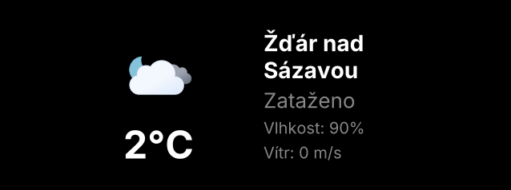
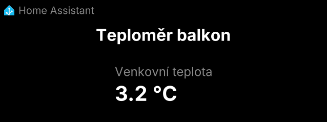
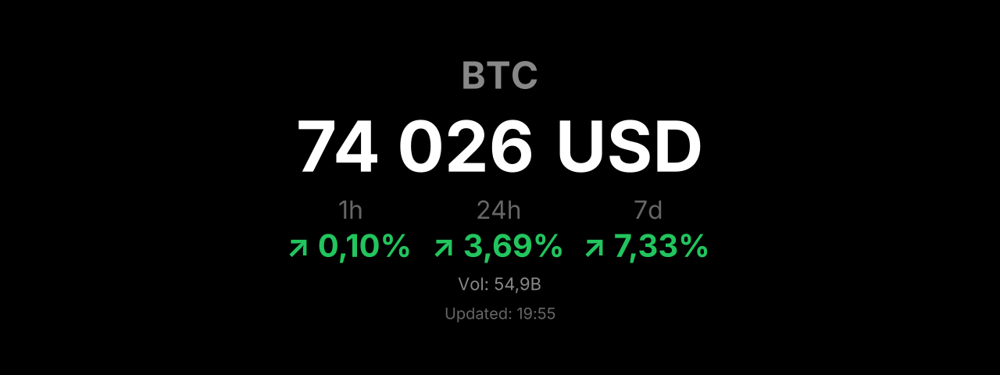
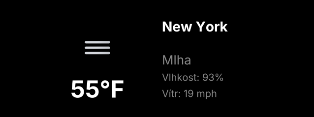

# BraiinsDeck Widget Server

> [Česká verze](./README.CS.md)

A small local server that generates **widget images** (PNG or JPG) on demand for the **BraiinsDeck** display. Clocks, date, weather, crypto prices, Smart Home values (Home Assistant) — BraiinsDeck simply fetches and displays an image from a URL.

Widgets are configured in a YAML file. Each widget then gets its own URL, for example:

```text
http://localhost:3000/widget/btc-price.png
```

This URL can be loaded by BraiinsDeck, a browser, or any other device that can display a PNG/JPG image. For BraiinsDeck you need to use the network address of the computer running the server.

<p align="center">
  
</p>

---

## Table of Contents

1. [What the server can do](#what-the-server-can-do)
2. [Quick start](#quick-start)
3. [Widget URL](#widget-url)
4. [Display sizes](#display-sizes)
5. [Built-in widgets](#built-in-widgets)
6. [Configuration – `config.yaml`](#configuration--configyaml)
7. [Local configuration – `config.local.yaml`](#local-configuration--configlocalyaml)
8. [Environment variables and `.env`](#environment-variables-and-env)
9. [Dark and light theme](#dark-and-light-theme)
10. [Custom widget](#custom-widget)
11. [How the server processes a request](#how-the-server-processes-a-request)
12. [API endpoints and debugging](#api-endpoints-and-debugging)
13. [Cache](#cache)
14. [Fonts](#fonts)
15. [Troubleshooting](#troubleshooting)
16. [Project structure](#project-structure)
17. [Technologies](#technologies)
18. [License](#license)

---

## What the server can do

The server generates image widgets in several sizes and in dark or light theme. The default configuration includes several example widgets that work right out of the box.

| Widget                                     | Preview                                                     |
| ------------------------------------------ | ----------------------------------------------------------- |
| **Fuzzy clock** – text "word" clock        |    |
| **Date** – date, day of week, week number  |                  |
| **Weather** – weather from OpenWeatherMap  |  |
| **Crypto ticker** – BTC/ETH/… price        |       |
| **Home Assistant** – entity values from HA |       |

The same widget can have different dimensions depending on the size requested by the device. Example for Bitcoin:

| Size                 | Preview                                           |
| -------------------- | ------------------------------------------------- |
| `size=s` (317×238)   |        |
| `size=m` (638×238)   |       |
| `size=l` (638×480)   |        |
| `size=fs` (1280×480) |  |

---

## Quick start

The goal of this section is to install the server, start it, and open the first generated image in a browser. The default widgets work without API keys (except weather).

### 1. Prerequisites

- **Node.js 20 or newer** – verify with `node -v`.
- Git, if you're downloading the project from a repository. If you have a ZIP archive, just extract it.

### 2. Installation

In the project root directory, run:

```bash
npm install
```

### 3. Starting the server

For development:

```bash
npm run dev
```

In this mode the server automatically restarts when code changes.

For regular use:

```bash
npm run build
npm start
```

The server will run at:

```text
http://localhost:3000
```

### 4. First image

Open in a browser:

```text
http://localhost:3000/widget/fuzzy-clock.png
```

If you see an image with the current time written out in words, the server is running correctly.

### 5. Try more widgets

The default configuration includes these widgets among others:

- `fuzzy-clock`
- `date`
- `weather-zdar`
- `btc-price`
- `eth-price`
- `ha-balkon`

The size can be changed with a query parameter:

```text
http://localhost:3000/widget/btc-price.png?size=s
http://localhost:3000/widget/btc-price.png?size=m
http://localhost:3000/widget/btc-price.png?size=l
http://localhost:3000/widget/btc-price.png?size=fs
```

Light theme:

```text
http://localhost:3000/widget/btc-price.png?theme=light
```

Bypassing cache during debugging:

```text
http://localhost:3000/widget/btc-price.png?refresh=1
```

### 6. Address for BraiinsDeck

The `localhost` address only works on the computer running the server. BraiinsDeck is a different device on the network, so you need to give it the network IP address of that computer.

If the server runs on a computer with IP address:

```text
192.168.1.50
```

then the widget address for BraiinsDeck will look like:

```text
http://192.168.1.50:3000/widget/fuzzy-clock.png
```

And for a specific widget with parameters, for example:

```text
http://192.168.1.50:3000/widget/btc-price.png?size=m&theme=dark
```

Find your computer's IP address as follows:

#### Windows

```powershell
ipconfig
```

Look for the network adapter through which the computer is connected to the network, and the `IPv4 Address` value.

#### Linux / macOS

```bash
ip addr
```

or:

```bash
ifconfig
```

Look for the local network address, typically in the form `192.168.x.x`, `10.x.x.x`, or `172.16.x.x`.

For everyday use it makes sense to run the server on a device that is always or mostly on — for example a home server, mini PC, Raspberry Pi, NAS, or a computer that is never switched off. If the device's IP address changes, the URL in BraiinsDeck will need to be updated accordingly. A practical solution is to set up a static DHCP reservation for the device in your router.

---

## Widget URL

A widget is loaded via the endpoint:

```text
GET /widget/{widgetId}.{format}?size=...&theme=...&locale=...&tz=...
```

### Required parts of the URL

| Part         | Meaning                      | Example        |
| ------------ | ---------------------------- | -------------- |
| `{widgetId}` | Widget ID from `config.yaml` | `btc-price`    |
| `{format}`   | Output format                | `png` or `jpg` |

### Optional parameters

| Parameter           | Meaning                                                    | Default                |
| ------------------- | ---------------------------------------------------------- | ---------------------- |
| `size`              | Display size: `s`, `m`, `l`, `fs`                          | from `defaults.size`   |
| `theme`             | Theme: `dark` or `light`                                   | from `defaults.theme`  |
| `locale`            | Locale, e.g. `cs-CZ`, `en-US`                              | from `defaults.locale` |
| `tz`                | Time zone, e.g. `Europe/Prague`                            | from `defaults.tz`     |
| `refresh`           | `1` bypasses the cache for a single request                | –                      |
| `deck_image_width`  | Custom width in px — BraiinsDeck sends this automatically  | –                      |
| `deck_image_height` | Custom height in px — BraiinsDeck sends this automatically | –                      |

### Examples

```text
http://localhost:3000/widget/fuzzy-clock.png
http://localhost:3000/widget/btc-price.png?size=s
http://localhost:3000/widget/weather-zdar.png?size=l&theme=light
http://localhost:3000/widget/btc-price.png?size=fs&refresh=1
```

---

## Display sizes

BraiinsDeck uses four standard sizes. The server returns these dimensions:

| Key  | Dimensions (px) | Description                     |
| ---- | --------------- | ------------------------------- |
| `s`  | 317 × 238       | Small – one slot                |
| `m`  | 638 × 238       | Medium – two slots side by side |
| `l`  | 638 × 480       | Large – two slots tall and wide |
| `fs` | 1280 × 480      | Fullscreen                      |

The server also accepts `deck_image_width` and `deck_image_height` parameters. BraiinsDeck sends these automatically. For caching purposes, a custom size is mapped to the nearest standard size.

---

## Built-in widgets

Built-in widgets are included with the server. They are used in `config.yaml` via the `type` field.

### Fuzzy clock (`type: fuzzy-clock`)

Word clock, for example "it's half past eight" or "it's quarter to five". The language follows the `locale` value.

```yaml
- id: fuzzy-clock
  type: fuzzy-clock
  config:
    showDigital: true # optionally also shows the digital time
```


### Date (`type: date`)

Date, optionally with day of week and week number.

```yaml
- id: date
  type: date
  config:
    weekday: long # short | long  (omit = do not show)
    month: long # numeric | 2-digit | short | long
    showWeekNumber: true
    locale: cs-CZ # overrides defaults.locale for this widget only
```

| Default                                              | With day of week and week number             | English                                          |
| ---------------------------------------------------- | -------------------------------------------- | ------------------------------------------------ |
|  |  |  |

### Weather (`type: weather`)

Current weather from OpenWeatherMap. Without an `apiKey` the widget renders sample data and warns that it is not a real result.

```yaml
- id: weather-zdar
  type: weather
  config:
    city: Žďár nad Sázavou
    country: CZ
    apiKey: "${OPENWEATHER_API_KEY}" # optional
    units: metric # metric | imperial
```

An API key can be obtained at [openweathermap.org](https://openweathermap.org/api). The recommended place to store it is the `.env` file.

| Žďár nad Sázavou                                     | New York                                           |
| ---------------------------------------------------- | -------------------------------------------------- |
|  |  |

### Crypto ticker (`type: crypto-ticker`)

Current cryptocurrency price from CoinGecko. No API key required.

```yaml
- id: btc-price
  type: crypto-ticker
  config:
    coin: BTC # BTC, ETH, USDT, BNB, XRP, ADA, DOGE, SOL, DOT, MATIC
    fiat: USD # USD, EUR, CZK, …
    showVolume: true # shows volume
    showChange: all # 1h | 24h | 7d | all  (default 24h)
```


### Home Assistant (`type: homeassistant`)

Displays the state of one or more entities from Home Assistant.

```yaml
- id: ha-balkon
  type: homeassistant
  config:
    title: "Balcony thermometer"
    entities:
      - sensor.outdoor_temperature
      - sensor.outdoor_humidity
    # host: http://homeassistant.local:8123  # optionally overrides HA_HOST
    # token: "${HA_TOKEN}"                   # optionally overrides HA_TOKEN
```

To connect to Home Assistant you need to set:

- `HA_HOST` – URL of the Home Assistant instance,
- `HA_TOKEN` – long-lived access token from the user profile in HA.

Both values should be stored in `.env`.


---

## Configuration – `config.yaml`

The main configuration is in the `config.yaml` file in the project root. It contains three main sections:

- `server` – HTTP server settings, authentication, and fonts,
- `defaults` – default values for widgets,
- `widgets` – list of available widgets.

Example:

```yaml
server:
  port: 3000
  host: 0.0.0.0
  # authToken: "${WIDGET_AUTH_TOKEN}"   # optional Bearer token
  fonts:
    - family: Inter
      file: fonts/Inter-Regular.ttf
      weight: 400
    - family: Inter
      file: fonts/Inter-Bold.ttf
      weight: 700
    - family: Inter
      file: fonts/Inter-Black.ttf
      weight: 900

defaults:
  locale: cs-CZ
  tz: Europe/Prague
  theme: dark # dark | light
  size: m # s | m | l | fs

widgets:
  - id: fuzzy-clock
    type: fuzzy-clock

  - id: btc-price
    type: crypto-ticker
    config:
      coin: BTC
      fiat: USD
```

Each widget must have a unique `id`. The server can load it in three ways:

| Method                          | Use                                           |
| ------------------------------- | --------------------------------------------- |
| `type: ...`                     | Built-in widget included with the server      |
| `file: ./widgets/foo.tsx`       | Custom local widget                           |
| ~~`plugin: "@author/package"`~~ | ~~Widget from an NPM package~~ maybe someday… |

After changing `config.yaml` the server needs to be restarted. In `npm run dev` mode the restart happens automatically.

---

## Local configuration – `config.local.yaml`

For personal settings, API keys, or local tweaks you can use a `config.local.yaml` file. This file is in `.gitignore` and takes precedence over the main `config.yaml`.

Sample file:

```text
config.local.yaml.example
```

Copy it with:

```bash
cp config.local.yaml.example config.local.yaml
```

### Configuration merge rules

- `server` and `defaults` are merged key by key.
- Values from `config.local.yaml` override the same values from `config.yaml`.
- `widgets` are merged by `id`.

Widget merge behaviour:

- a widget with the same `id` in the local config replaces the widget from the base config,
- widgets only in the base config are kept,
- widgets only in the local config are added.

### Example

```yaml
# config.local.yaml
server:
  port: 8080

defaults:
  theme: light

widgets:
  # Overrides the weather-zdar widget from the base config
  - id: weather-zdar
    type: weather
    config:
      city: Brno
      country: CZ
      apiKey: "${OPENWEATHER_API_KEY}"
      units: metric

  # Adds a new widget
  - id: my-test
    type: fuzzy-clock
    config:
      showDigital: true
```

On startup the server prints to the console how the configuration was merged.

---

## Environment variables and `.env`

Sensitive values such as API keys and tokens do not belong directly in the YAML config. For these values there is a `.env` file which the server loads automatically.

A template is in:

```text
.env.example
```

Example `.env`:

```env
# Optional Bearer token for API server access
WIDGET_AUTH_TOKEN=secret-token

# OpenWeatherMap
OPENWEATHER_API_KEY=your-key

# Home Assistant
HA_HOST=http://homeassistant.local:8123
HA_TOKEN=your-long-lived-access-token
```

In the YAML config, environment variables are referenced with the `${VARIABLE_NAME}` syntax:

```yaml
widgets:
  - id: weather-zdar
    type: weather
    config:
      apiKey: "${OPENWEATHER_API_KEY}"
```

The `.env` file is in `.gitignore`, so it will not normally end up in the repository.

---

## Dark and light theme

A widget can use a dark or light theme. The theme can be set globally in `defaults.theme` or per request with a query parameter:

```text
?theme=dark
?theme=light
```

In custom widgets you can use the prepared colour palette:

```ts
import { getThemeColors } from "../src/styles/common.js";

const colors = getThemeColors(theme); // theme = "dark" | "light"
// colors.bg, colors.text, colors.subtext, colors.muted, ...
```

Alternatively, define colours directly in the widget:

```ts
const bg = theme === "dark" ? "#1a1a1a" : "#f5f5f5";
const text = theme === "dark" ? "#ffffff" : "#0a0a0a";
const subtext = theme === "dark" ? "#888888" : "#666666";
```

---

## Custom widget

A custom widget can be added as a standalone `.tsx` file in the `widgets/` directory.

### 1. Create the file

The easiest way is to copy the ready-made example:

```bash
cp widgets/example.tsx widgets/my-widget.tsx
```

### 2. Minimal widget

The file `widgets/my-widget.tsx` could look like this:

```ts
import type { Widget, WidgetProps } from "../src/types.js";

interface MyConfig {
  title?: string;
  value?: number;
}

async function MyWidget(props: WidgetProps<MyConfig>) {
  const { width, height, config, theme, locale, tz } = props;

  const bg = theme === "dark" ? "#1a1a1a" : "#ffffff";
  const text = theme === "dark" ? "#ffffff" : "#0a0a0a";

  return {
    type: "div",
    props: {
      style: {
        width: `${width}px`,
        height: `${height}px`,
        display: "flex",
        flexDirection: "column",
        justifyContent: "center",
        alignItems: "center",
        background: bg,
        color: text,
        fontFamily: "Inter, sans-serif",
      },
      children: [
        {
          type: "div",
          props: {
            style: {
              fontSize: `${Math.min(width / 10, height / 4)}px`,
              fontWeight: 700,
            },
            children: config.title || "Hello",
          },
        },
      ],
    },
  };
}

export default {
  component: MyWidget,
  cacheTtl: 60, // seconds
} as Widget<MyConfig>;
```

### 3. Fetching external data

If a widget needs data from an external API, it can export a `fetchData` function. The server will call it before rendering and store the result in the data cache.

```ts
export default {
  component: MyWidget,
  cacheTtl: 300,
  fetchData: async (config) => {
    const res = await fetch(`https://api.example.com/${config.symbol}`);
    return res.json();
  },
} as Widget<MyConfig>;
```

### 4. Registering the widget

There are two options.

#### Option A – automatic file discovery

If the file is in the `widgets/` directory, the server will find it automatically on startup. The file `widgets/my-widget.tsx` will be available as widget ID `my-widget`.

```text
http://localhost:3000/widget/my-widget.png
```

#### Option B – registration via config

If the widget needs its own configuration, add it to `config.yaml`:

```yaml
widgets:
  - id: my-widget
    file: ./widgets/my-widget.tsx
    config:
      title: "Hello"
      value: 42
```

### 5. Testing

After starting the server, open:

```text
http://localhost:3000/widget/my-widget.png
```

During debugging it can be handy to bypass the cache:

```text
http://localhost:3000/widget/my-widget.png?refresh=1
```

### Responsive layout

A widget receives the actual dimensions in `props.width` and `props.height`. These can be used to adjust font size, layout, or the amount of information shown.

```ts
const titleSize = Math.min(width / 20, height / 10);
const valueSize = Math.min(width / 4, height / 2.5);

const isSmall = width < 400;
const isFullscreen = width > 1000;
```

The helper `getDeckSize(width, height)` from `src/types.js` is also available and returns the symbolic size:

```ts
"s" | "m" | "l" | "fs";
```

### Satori limitations

Rendering is handled by the [Satori](https://github.com/vercel/satori) library. It does not support all CSS, only a subset.

Practical limitations:

- styles are passed inline via a `style: { ... }` object,
- CSS classes and external CSS files are not used,
- dimensions should be in `px`,
- flexbox works,
- `position: absolute` works,
- gradients work,
- CSS grid, complex selectors, and pseudo-classes like `:hover` are not suitable.

---

## How the server processes a request

Every widget request goes through the rendering pipeline:

1. **Fastify** receives the request `GET /widget/:widgetId.:format`.
2. `parseRenderRequest()` builds a normalised `RenderRequest` from the URL and query parameters.
3. `RenderService` checks the image cache.
4. If there is a ready image in the cache, the server returns it immediately and sets the `X-Cache: HIT` header.
5. If no image is in the cache, the widget is loaded via `loader.ts`.
6. If the widget contains `fetchData(config)`, the server calls this function and stores the result in the data cache.
7. The widget component receives `WidgetProps` and returns a JSX-like object `{ type, props }`.
8. `renderer.ts` passes the result to Satori, which creates an SVG.
9. Sharp converts the SVG to PNG or JPG.
10. The finished buffer is stored in the image cache and returned to the client.

The image cache key is composed of:

```text
widgetId|size|format|theme|locale|tz
```

### Key files

| File                                   | Purpose                                                                    |
| -------------------------------------- | -------------------------------------------------------------------------- |
| `src/server.ts`                        | Server startup, Fastify, routes, authentication                            |
| `src/config.ts`                        | Loading and merging configs, expanding `${ENV}` variables                  |
| `src/loader.ts`                        | Widget discovery and loading, transpilation via esbuild                    |
| `src/types.ts`                         | `WidgetProps`, `Widget`, `DECK_SIZES`, `parseRenderRequest`, `getDeckSize` |
| `src/renderer.ts`                      | Satori, Sharp, font loading                                                |
| `src/cache.ts`                         | Image cache, data cache, cache statistics                                  |
| `src/services/render.service.ts`       | Rendering orchestration: cache → data → render → cache                     |
| `src/controllers/widget.controller.ts` | Endpoints `/health`, `/widgets`, `/widget/...`, `/debug/...`               |
| `src/widgets/*.tsx`                    | Built-in widgets                                                           |

---

## API endpoints and debugging

### `GET /widget/:widgetId.:format`

Returns a binary image in PNG or JPG format.

The `X-Cache` header shows whether the result was served from cache:

```text
X-Cache: HIT
X-Cache: MISS
```

### `GET /widgets`

Returns a list of loaded widgets including whether they have `fetchData` and what `cacheTtl` they use.

Example response:

```json
{
  "total": 7,
  "widgets": [
    { "id": "fuzzy-clock", "cacheTtl": 60, "hasFetchData": false },
    { "id": "btc-price", "cacheTtl": 60, "hasFetchData": true }
  ]
}
```

### `GET /health`

Returns a health check and basic cache statistics.

```json
{
  "status": "ok",
  "uptime": 123.45,
  "widgets": 7,
  "cache": {
    "image": { "keys": 15, "hits": 42, "misses": 8 },
    "data": { "keys": 3, "hits": 20, "misses": 2 }
  }
}
```

### `GET /debug/:widgetId`

Returns JSON with information useful when debugging a widget:

- input props,
- parsed `RenderRequest`,
- `cacheTtl`,
- information about the resulting element.

This endpoint is useful when a widget renders differently than expected, or when you want to verify the values passed to the component.

### Authentication

If `server.authToken` is set, all requests must include the HTTP header:

```text
Authorization: Bearer your-token
```

Typical setup via environment variable:

```yaml
server:
  authToken: "${WIDGET_AUTH_TOKEN}"
```

---

## Cache

The server uses two separate cache layers.

| Layer           | What is cached           | TTL               |
| --------------- | ------------------------ | ----------------- |
| **Image cache** | Finished PNG/JPG buffers | `widget.cacheTtl` |
| **Data cache**  | Results of `fetchData()` | `widget.cacheTtl` |

The image cache stores the finished image. The data cache stores the result of external data fetching, for example from CoinGecko or Home Assistant.

Image cache key:

```text
widgetId|size|format|theme|locale|tz
```

The cache can be bypassed for a single request with the parameter:

```text
?refresh=1
```

The cache is in-memory only. It is cleared on server restart.

---

## Fonts

Satori needs fonts to be available before rendering. The default configuration uses three weights of the Inter font:

```text
fonts/
├── Inter-Regular.ttf  (weight 400)
├── Inter-Bold.ttf     (weight 700)
└── Inter-Black.ttf    (weight 900)
```

A custom font can be added in `config.yaml`:

```yaml
server:
  fonts:
    - family: Inter
      file: fonts/Inter-Regular.ttf
      weight: 400
    - family: "Roboto Mono"
      file: fonts/RobotoMono-Regular.ttf
      weight: 400
```

The font is then used in a widget via `fontFamily`:

```ts
style: {
  fontFamily: "Roboto Mono, monospace";
}
```

---

## Troubleshooting

### Server does not start and reports "Failed to load configuration"

Check that:

- `config.yaml` exists in the project root,
- it is valid YAML,
- it contains the `server`, `defaults`, and `widgets` sections,
- the indentation in YAML matches the structure of objects and arrays.

### Widget fails to load with "Widget '...' must export a Widget with a component function"

Possible causes:

- the `.tsx` file does not contain `export default`,
- the exported object does not have `component`,
- `component` is not an `async` function,
- the `id` in the config does not match the file name or the expected ID,
- the path in `file` does not point to an existing file.

Minimal export:

```ts
export default {
  component: MyWidget,
  cacheTtl: 60,
};
```

### Image is blank or has a broken layout

Most common causes:

- using CSS properties that Satori does not support,
- styles are not passed inline,
- some dimensions are missing or not in `px`,
- the parent element does not have `display` set appropriately,
- the layout depends on CSS grid or external classes.

Recommended base for the root element:

```ts
style: {
  width: `${width}px`,
  height: `${height}px`,
  display: "flex",
}
```

### External API call fails

Depending on the widget type, check:

- for weather: `OPENWEATHER_API_KEY` value and city name,
- for Home Assistant: `HA_HOST` and `HA_TOKEN` values,
- for crypto: CoinGecko rate limit.

If an API frequently returns an error or rate limit, increase `cacheTtl`.

### Change in `config.yaml` has no effect

In production mode the server needs to be restarted after a config change.

In dev mode:

```bash
npm run dev
```

the server should restart automatically.

When debugging a specific URL it may be necessary to bypass the image cache:

```text
?refresh=1
```

### Port 3000 is already in use

Change the port in `config.yaml` or `config.local.yaml`:

```yaml
server:
  port: 8080
```

---

## Project structure

```text
braiins-deck-image-widget-server/
├── package.json
├── tsconfig.json
├── config.yaml                  # main configuration
├── config.local.yaml.example    # local configuration template
├── .env.example                 # environment variables template
├── README.md                    # English documentation
├── README.CS.md                 # Czech documentation
│
├── src/
│   ├── server.ts                # Fastify bootstrap
│   ├── config.ts                # YAML loader + merge
│   ├── loader.ts                # Widget discovery
│   ├── renderer.ts              # Satori + Sharp
│   ├── cache.ts                 # Cache wrapper
│   ├── types.ts                 # WidgetProps, DECK_SIZES, helpers
│   ├── controllers/
│   │   └── widget.controller.ts
│   ├── services/
│   │   └── render.service.ts
│   ├── styles/
│   │   └── common.ts            # getThemeColors()
│   └── widgets/                 # built-in widgets
│       ├── fuzzy-clock.tsx
│       ├── date.tsx
│       ├── weather.tsx
│       ├── crypto-ticker.tsx
│       └── homeassistant.tsx
│
├── widgets/                     # custom widgets
│   ├── README.md
│   └── example.tsx
│
├── fonts/                       # TTF fonts
│   ├── Inter-Regular.ttf
│   ├── Inter-Bold.ttf
│   └── Inter-Black.ttf
│
└── docs/
    └── images/                  # widget screenshots for README
```

---

## Technologies

- **Node.js 20+**
- **TypeScript 5.7+**
- **Fastify** – HTTP server
- **Satori** – converts JSX-like structure to SVG
- **Sharp** – converts SVG to PNG/JPG
- **NodeCache** – in-memory cache
- **YAML** – configuration
- **esbuild** – transpiles custom `.tsx` widgets
- **dotenv** – loads `.env`

---

## License

MIT – see [LICENSE](./LICENSE).
